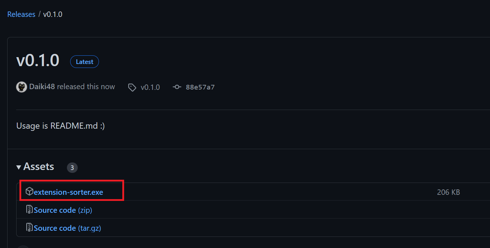
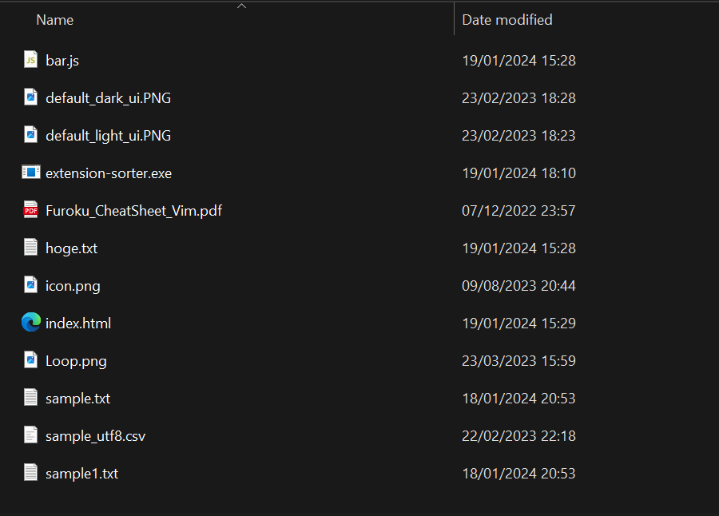
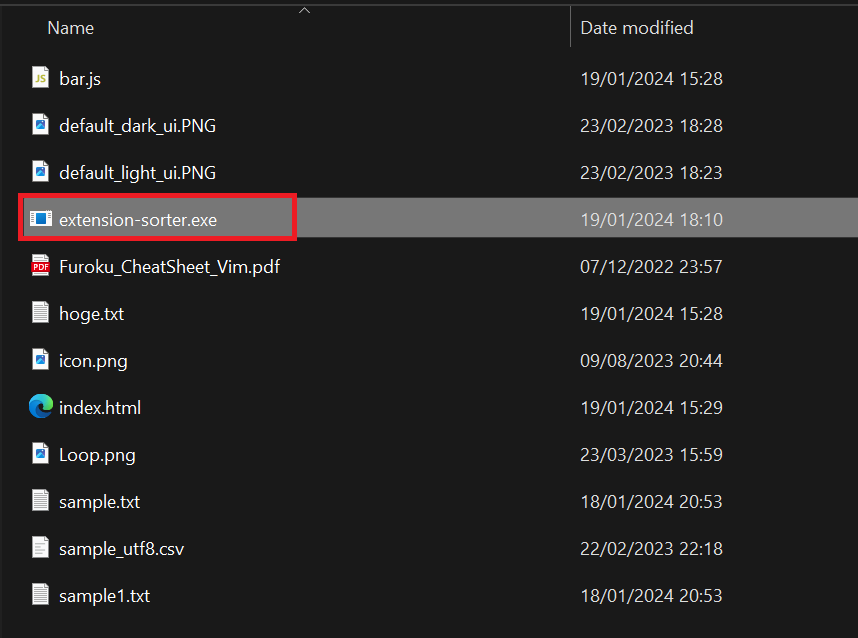
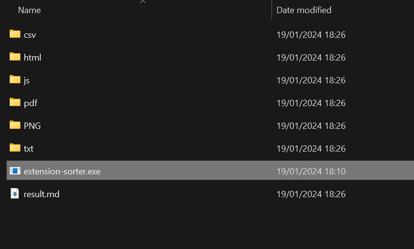
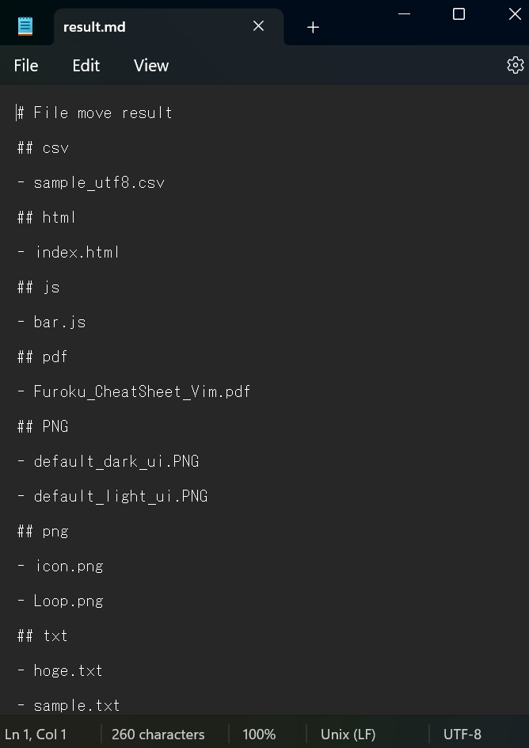

# extension-sorter

Organize files by extension.

# Usage

## 1. Download the executable file from GitHub.

Downloading from [GitHub](https://github.com/Daiki48/extension-sorter).

Press tag.

Press **extension-sorter.exe**.

## 2. Place extension-sorter.exe in the directory where you want to organize your files.

## 3. Run extension-sorter.exe.

## 4. A directory with the extension name is generated.

## 5. The results are recorded in the result.md file.

# LICENSE

MIT

# Author

Daiki Nakashima